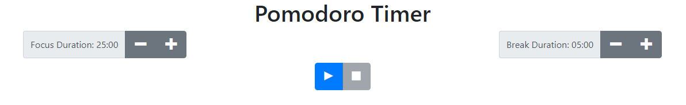

# Pomodoro Timer

## Live Demo:

* A live demo can be found [here](https://project-pomodoro-timer-qualified-1-ochre.vercel.app/)

## Description

This project is a Pomodoro timer, which uses a timer to break work time in intervals alternating between focusing and breaks so that users can optimize their focus.

## Background

This technique was developed by Francesco Cirillo in the 1980s, and was named ‘pomodoro’ after his tomato kitchen timer he used to study and take breaks.

## Features

The Pomodoro timer allows for users to increase/decrease their focus and break times by 1 minute and 5 minutes, respectively.

## Technologies & tools

* React was used to make this project, utilizing state in each component to determine modification for the timer.
